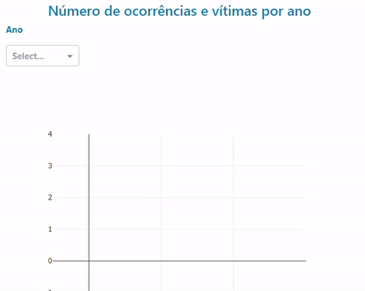
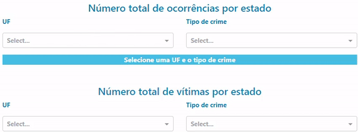
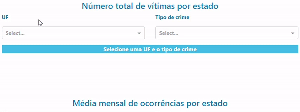
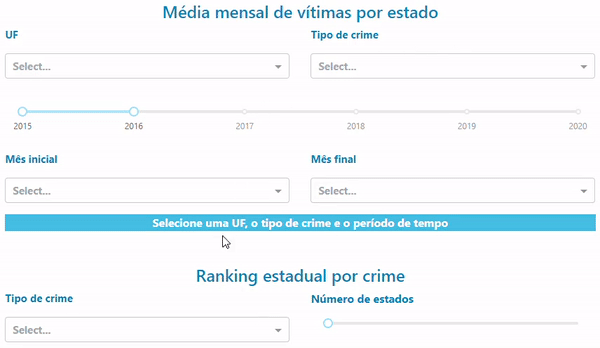
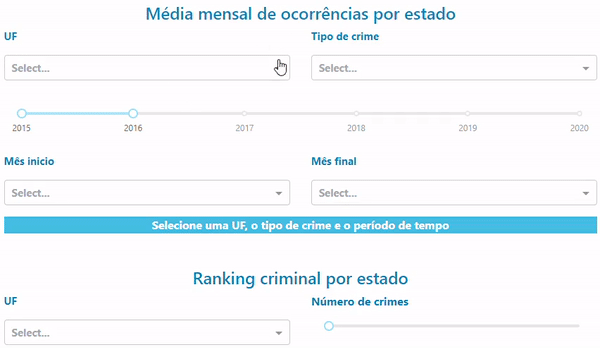
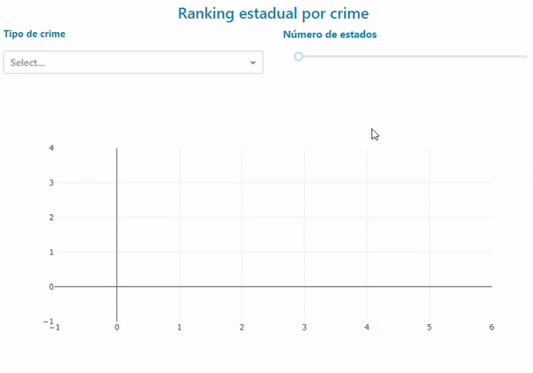
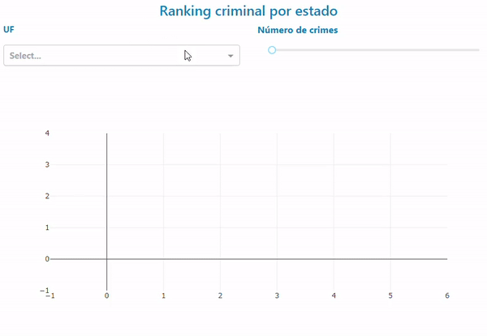

# dash-interface-API

Interface em Dash para visualização de análise de dados através de API em Flask.

Dataset **<indicadoressegurancapublicauf(mes)(ano)>.xlsx** obtido em http://dados.gov.br/dataset/sistema-nacional-de-estatisticas-de-seguranca-publica

## Funções

### Número de ocorrências e vítimas por ano

### Número total de ocorrências por estado

### Número total de vítimas por estado

### Média mensal de vítimas por estado

### Média mensal de ocorrências por estado

### Ranking estadual por crime

### Ranking criminal por estado

